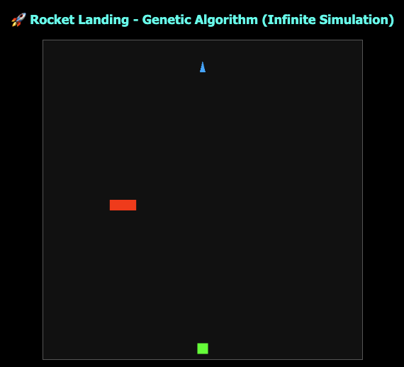
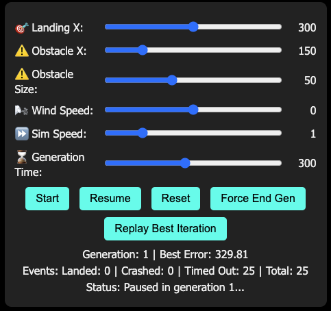

# 🚀 Rocket Landing Simulation with Genetic Algorithm

A JavaScript simulation that demonstrates how genetic algorithms can be used to learn optimal landing trajectories for rockets, inspired by the stochastic control concepts of Lars Blackmore at MIT.

## Features

- Interactive simulation with adjustable parameters
- Genetic algorithm implementation for rocket trajectory optimization
- Real-time visualization of rocket landings
- Multiple generations of rockets with increasing landing success rates
- Obstacles and environmental factors (wind, gravity)
- Replay functionality for the best landing trajectory

## How It Works


### Movement & Control
Each rocket applies a "DNA" force (a predetermined control vector) each frame, along with added forces from gravity and wind. A rocket is considered "landed" if it lands close to the landing pad (within 10 pixels horizontally and near the bottom of the canvas) and "crashed" if it collides with an obstacle or leaves the canvas. If time runs out, it is marked as "timed out."

### Fitness & Error Calculation
The fitness of a rocket is based on its error (i.e., distance from the landing pad). The error is computed as the Euclidean distance from the rocket's current position to the center of the landing pad at (landingX, canvas.height – 20):

```
error = √[(rocket.pos.x – landingX)² + (rocket.pos.y – (canvas.height – 20))²]
```

This trigonometric approach provides a more accurate assessment of how far each rocket is from the target landing area. Fitness is calculated as the inverse of error, with bonuses for successful landings and penalties for crashes.

### Genetic Algorithm
When all rockets in a generation finish (land, crash, or time out), their fitness values are calculated, the best performers are selected, and a new generation is automatically produced. The simulation uses a population size of 25 rockets, with the top 50% serving as parents for the next generation. This simulation is inspired by stochastic control concepts but simplified by focusing on key environmental factors like wind speed and gravity.

## Controls

The simulation provides several interactive controls to adjust parameters:

- **Landing X**: Slider to adjust the horizontal position of the landing pad (range: 50-550 pixels)
- **Obstacle X**: Slider to control the horizontal position of the obstacle (range: 50-550 pixels)
- **Obstacle Size**: Slider to adjust the width of the obstacle (range: 20-100 pixels)
- **Wind Speed**: Slider to control the strength and direction of wind (-1 to 1, negative values push left, positive values push right)
- **Sim Speed**: Slider to adjust the simulation speed (0.5x to 3x)
- **Generation Time**: Slider to set how many frames each generation lives (50 to 600 frames)

Button controls:
- **Start**: Begin a new simulation
- **Pause/Resume**: Toggle the simulation
- **Reset**: Start over with a new population
- **Force End Gen**: End the current generation immediately
- **Replay Best Iteration**: Show the trajectory of the best performing rocket

## Simulation Details

The code implements these key components:

- **Rocket Physics**: Each rocket has position, velocity, and acceleration vectors
- **DNA**: Each rocket's DNA contains control forces for each frame of the simulation
- **Fitness Function**: Rewards proximity to the landing target, with bonuses for successful landings
- **Selection & Reproduction**: The top 50% of rockets become parents for the next generation
- **Mutation**: Each gene has a 1% chance of random mutation during reproduction

Key constants in the simulation:
- `GRAVITY`: 0.03 (downward force per frame)
- `WIND_SCALE`: 0.1 (scaling factor for wind effect)
- `GENE_FACTOR`: 0.2 (maximum magnitude for DNA force vectors)
- `POP_SIZE`: 25 (number of rockets per generation)

## Theoretical Background: Stochastic Control

This simulation is inspired by the stochastic control research of Lars Blackmore, which focuses on developing robust control algorithms for autonomous air and space systems. Lars Blackmore's work addresses critical challenges in real-world applications of autonomous control:

### Challenges in Autonomous Control
Traditional control algorithms often fail to account for real-world uncertainty from:
1. Environmental disturbances (e.g., wind acting on vehicles)
2. Localization uncertainty (e.g., visual odometry errors)
3. Imperfect system modeling

### Probabilistic Approach
Blackmore's research poses the problem as a constrained probabilistic control challenge:
- Finding optimal control sequences while accounting for uncertainty
- Ensuring the probability of failure remains below specified thresholds
- Allowing for controllable conservatism in planning (trading fuel efficiency for safety)

### Application to Rocket Landing
In our simulation, we implement a simplified version of these concepts through:
- Genetic algorithms that evolve increasingly robust landing strategies
- Stochastic environmental factors (wind variations)
- Fitness evaluation based on landing success and efficiency

While our implementation is simplified compared to industrial applications, it demonstrates the core principles of evolving robust control strategies in uncertain environments.

## Future Improvements

Potential enhancements to the simulation:
- Fuel consumption optimization
- Varying atmospheric conditions
- Rocket orientation and thrust vector control
- Multi-objective optimization (balancing landing accuracy, fuel use, and safety)
- Real-time parameter adjustment during landing

## References

- Lars Blackmore's Stochastic Control Research: [http://www.larsblackmore.com/stochasticcontrol.htm](http://www.larsblackmore.com/stochasticcontrol.htm)
- Experience & Background: [http://www.larsblackmore.com/experience.htm](http://www.larsblackmore.com/experience.htm)